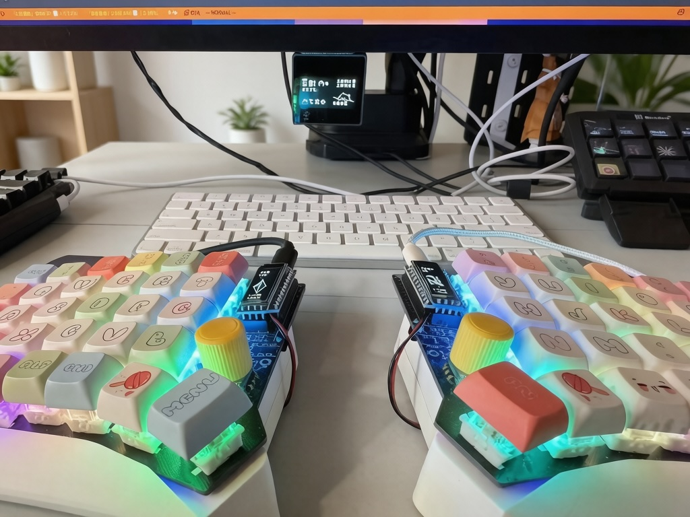

# nice!oled ZMK Shield

[](https://opensource.org/licenses/MIT)

A ZMK module that turns the cheap 128x32 SSD1306 OLEDs on split keyboards into a rich status screen —
battery, layer, output profile, modifiers, WPM, last pressed key and small animations — plus an optional
128x64 screen for a dongle that acts as the central.

<!-- TODO: add project photo -->
<p align="center">
  
</p>

## Highlights
- **Split-aware screens**: the central half and the peripheral half show different layouts
- **Dongle support**: a vendored 128x64 dongle screen (SH1106/SSD1306) when a dongle is the central
- **Status at a glance**: battery and charging, active layer, BLE profile / USB, modifiers, HID indicators (Caps Lock, …)
- **Typing feedback**: WPM counter and the last pressed key
- **Animations**: Luna the dog, crystal / spaceman, gem and Pokémon animations on the peripheral
- **Stable on real hardware**: 400 kHz I2C, reboot instead of freezing on a fatal error
- **Built on ZMK 0.4**: Zephyr 4.1 and LVGL 9

## Supported Setups

| Setup | Shields | What each screen shows |
|---|---|---|
| Split, half as central | `<kb>_left nice_oled`, `<kb>_right nice_oled` | Central: output, layer, modifiers, WPM, keycode. Peripheral: battery and animation |
| Split with dongle | `<kb>_dongle dongle_display`, `<kb>_left nice_oled`, `<kb>_right nice_oled` | Dongle: everything above on 128x64. Both halves: peripheral screen |

Only the central receives keycodes, layers and modifiers, so with a dongle those widgets live on the dongle.

## Layout
| Central (128x32) | Peripheral (128x32) |
|---|---|
|  |  |

Pixel-level layout notes: [LAYOUT_DESIGN_v0.4.md](./LAYOUT_DESIGN_v0.4.md).

## Requirements
- `main` branch: ZMK 0.4 (in development) — Zephyr 4.1 and LVGL 9.x. The LVGL 9 layer-based drawing required
  rewriting the OLED code, so this branch does not build against older ZMK.
- Tag `v0.3`: ZMK 0.3 stable (Zephyr 3.5, LVGL 8.3).

## Installation

1. Add the module to `config/west.yml` in your `zmk-config`:
   ```yaml
   manifest:
     remotes:
       - name: zzuse
         url-base: https://github.com/zzuse
     projects:
       - name: zmk-nice-oled-zz
         remote: zzuse
         revision: main
   ```

2. Add the shield to `build.yaml`:
   ```yaml
   include:
     - board: nice_nano//zmk
       shield: sofle_left nice_oled
     - board: nice_nano//zmk
       shield: sofle_right nice_oled
   ```

3. Make sure the display is on in your `.conf`:
   ```
   CONFIG_ZMK_DISPLAY=y
   ```

### Dongle
Add the dongle build next to the halves:
```yaml
  - board: nice_nano//zmk
    shield: sofle_dongle dongle_display
```
- The dongle shield defines the `&oled` node. For a 1.3" SH1106 use `compatible = "sinowealth,sh1106"`,
  `height = <64>`, `multiplex-ratio = <63>`, `segment-offset = <2>`.
- The former central half must be a peripheral (`CONFIG_ZMK_SPLIT_ROLE_CENTRAL=n`). Set
  `CONFIG_NICE_OLED_PERIPHERAL_CRYSTAL=y` on it to keep the crystal animation.
- To rotate the dongle screen 180°, delete `segment-remap` and `com-invdir` from `&oled`. To swap black and
  white, delete `inversion-on`.

## Configuration

### nice_oled (halves)
| Option | Default | Description |
|---|---|---|
| `CONFIG_NICE_OLED_WIDGET_WPM` | y | WPM widget on the central |
| `CONFIG_NICE_OLED_WIDGET_WPM_LUNA` | y | Luna the dog reacts to WPM |
| `CONFIG_NICE_OLED_WIDGET_HID_INDICATORS` | y | Caps/Num/Scroll lock indicators |
| `CONFIG_NICE_OLED_WIDGET_MODIFIERS_INDICATORS` | y | Modifier indicators |
| `CONFIG_NICE_OLED_GEM_ANIMATION` | y | Gem animation on the peripheral |
| `CONFIG_NICE_OLED_POKEMON_ANIMATION` | n | Pokémon animation on the peripheral |
| `CONFIG_NICE_OLED_PERIPHERAL_CRYSTAL` | n | Crystal instead of spaceman on the peripheral (useful with a dongle) |
| `CONFIG_NICE_OLED_REBOOT_ON_FATAL` | y | Reboot instead of halting on a fatal error |
| `CONFIG_NICE_VIEW_WIDGET_INVERTED` | n | Invert display colors |

See `boards/shields/nice_oled/Kconfig.defconfig` for animation timings and the rest.

### dongle_display (dongle)
| Option | Default | Description |
|---|---|---|
| `CONFIG_ZMK_DONGLE_DISPLAY_KEY_STATUS` | y | Last pressed key (left middle, below the output/WPM row) |
| `CONFIG_ZMK_DONGLE_DISPLAY_KEY_STATUS_WIDTH` | 60 | Key label width in pixels |
| `CONFIG_ZMK_DONGLE_DISPLAY_WPM` | n | WPM next to the output status |
| `CONFIG_ZMK_DONGLE_DISPLAY_BONGO_CAT` | y | Bongo Cat animation |
| `CONFIG_ZMK_DONGLE_DISPLAY_MODIFIERS` | y | Modifier symbols |
| `CONFIG_ZMK_DONGLE_DISPLAY_MAC_MODIFIERS` | n | macOS modifier symbols instead of Windows |
| `CONFIG_ZMK_DONGLE_DISPLAY_LAYER` | y | Highest active layer name |
| `CONFIG_ZMK_DONGLE_DISPLAY_DONGLE_BATTERY` | n | Also show the dongle's own battery |

See `boards/shields/dongle_display/Kconfig.defconfig` for the rest.

## Project Structure
```
boards/shields/
├── nice_oled/              128x32 screen for the halves
│   ├── widgets/            screen.c (central), screen_peripheral.c, one file per widget
│   └── assets/             fonts (PixelOperatorMono 8/12/16), images, animations
└── dongle_display/         128x64 screen for a dongle, vendored from englmaxi/zmk-dongle-display
    └── widgets/            LVGL object widgets (output, battery, layer, bongo cat, key status, …)
```

### Widget Reference
| Widget | File | Description |
|---|---|---|
| Battery | `nice_oled/widgets/battery.[ch]` | Battery percentage and charging status |
| Layer | `nice_oled/widgets/layer.[ch]` | Active layer |
| Output | `nice_oled/widgets/output.[ch]` | Active output profile (BLE/USB) |
| Keycode | `nice_oled/widgets/keycode.[ch]` | Last key with modifier icons and raw HID code (e.g. `BSPC 07:2A`) on a central half |
| Keycode names | `nice_oled/widgets/keycode_name.[ch]` | Shared HID usage → short name table (`keycode_to_string()`), used by both key widgets |
| Dongle key status | `dongle_display/widgets/key_status.[ch]` | Last key name as an LVGL label on the dongle |

## Customization
- Fonts and images: `boards/shields/nice_oled/assets/` (see the assets README)
- Widget layout of the halves: `boards/shields/nice_oled/widgets/`
- Widget layout of the dongle: `boards/shields/dongle_display/custom_status_screen.c`

## Credits
- Dongle screen based on [englmaxi/zmk-dongle-display](https://github.com/englmaxi/zmk-dongle-display) (MIT)

## License
MIT — see [LICENSE](LICENSE).

## Contributors
- zzuse (Maintainer) — modified to suit my own needs
