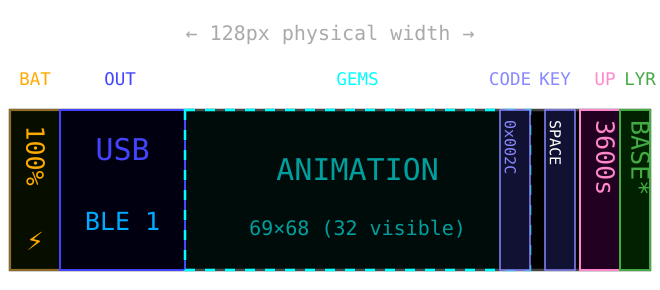
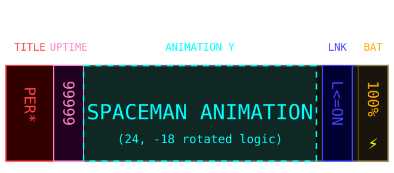

# nice!oled ZMK Shield

[](https://opensource.org/licenses/MIT)

## Project Overview
The nice!oled shield is a ZMK firmware module that provides a customizable OLED status screen for mechanical keyboards. It displays system information such as battery level, active layer, modifiers, output profile, WPM, and keycodes. The module is designed to be easily integrated into ZMK-based keyboard firmware.

## Dependence
   The main(development) branch dependent on ZMK 0.4 (the version currently in development), the west build command reflects significant changes in how Zephyr 4.1 handles hardware.  Underlying Libraries (The "Engine")
   * Zephyr RTOS: Upgraded from 3.5 to 4.1. This changed how the keyboard handles power, Bluetooth, and USB.
   * LVGL (Display): Upgraded from 8.3 to 9.x. This is why we had to rewrite your OLED code; the way the screen "draws" pixels was completely replaced with a more modern "layer-based" system.
   Using tag version v0.3 For ZMK 0.3 stable build.

## Features
- **Battery Status**: Shows current battery level and charging status
- **Layer Display**: Indicates the currently active keyboard layer
- **Modifier Keys**: Displays the state of modifier keys (Ctrl, Alt, Shift, etc.)
- **Output Profiles**: Shows the active output profile (BLE, USB) and connection status
- **WPM Counter**: Real-time words per minute tracking
- **Keycode Display**: Shows the last pressed keycode
- **Animations**: Optional animations (like Luna the dog) for visual feedback
- **Custom Fonts**: Supports custom fonts (including PixelOperatorMono in multiple sizes)
- **Inverted Color Scheme**: Configurable light/dark mode

## Installation
To use the nice!oled shield in your ZMK firmware:

1. Add this repository as a Zephyr module in your `zmk-config`:
   ```bash
   west.yml: 
     - name: zmk-nice-oled-zz
       url: https://github.com/zzuse/zmk-nice-oled-zz
       revision: main
   ```

2. Enable the shield in your `.conf` file:
   ```
   CONFIG_NICE_VIEW_WIDGET=y
   CONFIG_ZMK_DISPLAY=y
   ```

3. Add the shield to your keyboard's `.keymap` file

## Configuration
The following Kconfig options are available:
- `CONFIG_NICE_VIEW_WIDGET_INVERTED`: Invert display colors (default: n)
- `CONFIG_NICE_VIEW_WIDGET_STATUS`: Enable status screen (default: y)
- `CONFIG_NICE_VIEW_WIDGET_ANIMATION`: Enable animations (default: y)
- `CONFIG_NICE_OLED_PERIPHERAL_CRYSTAL`: Show the crystal animation on a peripheral instead of the spaceman, e.g. when a dongle is the central (default: n)

## Dongle Display
`boards/shields/dongle_display` is a 128x64 status screen for a dongle (central), vendored from
[englmaxi/zmk-dongle-display](https://github.com/englmaxi/zmk-dongle-display) (MIT). Add it next to your dongle shield:
```yaml
  - board: nice_nano//zmk
    shield: sofle_dongle dongle_display
```
The dongle shield defines the OLED node; for a 1.3" SH1106 use `compatible = "sinowealth,sh1106"` with `segment-offset = <2>`.
Options: `CONFIG_ZMK_DONGLE_DISPLAY_MAC_MODIFIERS`, `CONFIG_ZMK_DONGLE_DISPLAY_WPM`, `CONFIG_ZMK_DONGLE_DISPLAY_DONGLE_BATTERY`,
`CONFIG_ZMK_DONGLE_DISPLAY_KEY_STATUS` (last pressed key, default: y), `CONFIG_ZMK_DONGLE_DISPLAY_KEY_STATUS_WIDTH` (label width in px, default: 60)
(see `boards/shields/dongle_display/Kconfig.defconfig`).

Only the central sees keycodes, so with a dongle the last pressed key is shown on the dongle (left middle, below the
output/WPM row), not on the halves.

## Layout Design



## Customization
You can customize the display by:
- Adding custom fonts in `boards/shields/nice_oled/assets/`
- Adding custom images for animations
- Modifying the widget layouts in `boards/shields/nice_oled/widgets/`

## Widget Reference

### Keycode Widget
Displays last pressed keycode with modifier icons and the raw HID code (e.g. `BSPC 07:2A`) on a half acting as central  
**File**: `widgets/keycode.[ch]`

### Keycode Names
Shared HID usage → short name table (`keycode_to_string()`), used by both the nice_oled and dongle key widgets  
**File**: `widgets/keycode_name.[ch]`

### Dongle Key Status Widget
LVGL label on the dongle showing the last pressed key name; modifiers are shown by the dongle's own modifiers widget  
**File**: `boards/shields/dongle_display/widgets/key_status.[ch]`

### Battery Widget
Displays battery percentage and charging status  
**File**: `widgets/battery.[ch]`

### Layer Widget
Shows currently active layer  
**File**: `widgets/layer.[ch]`

### Output Widget
Displays active output profile (BLE/USB)  
**File**: `widgets/output.[ch]`

## License
This project is licensed under the MIT License - see the [LICENSE](LICENSE) file for details.

## Contributors
- zzuse (Maintainer) Modify to suit my own needs
